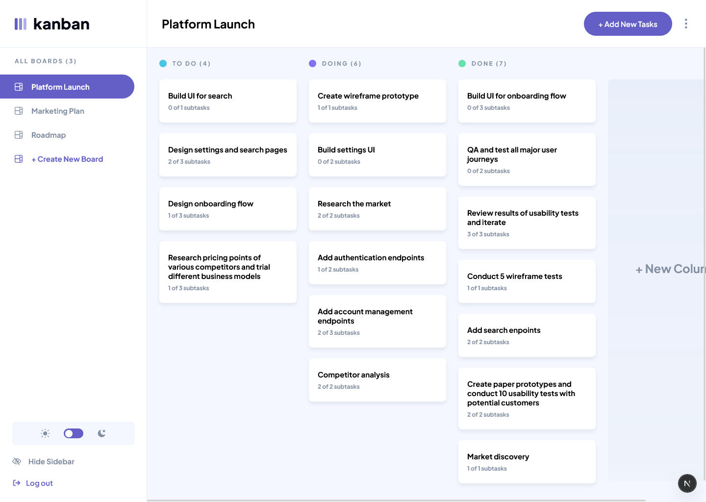
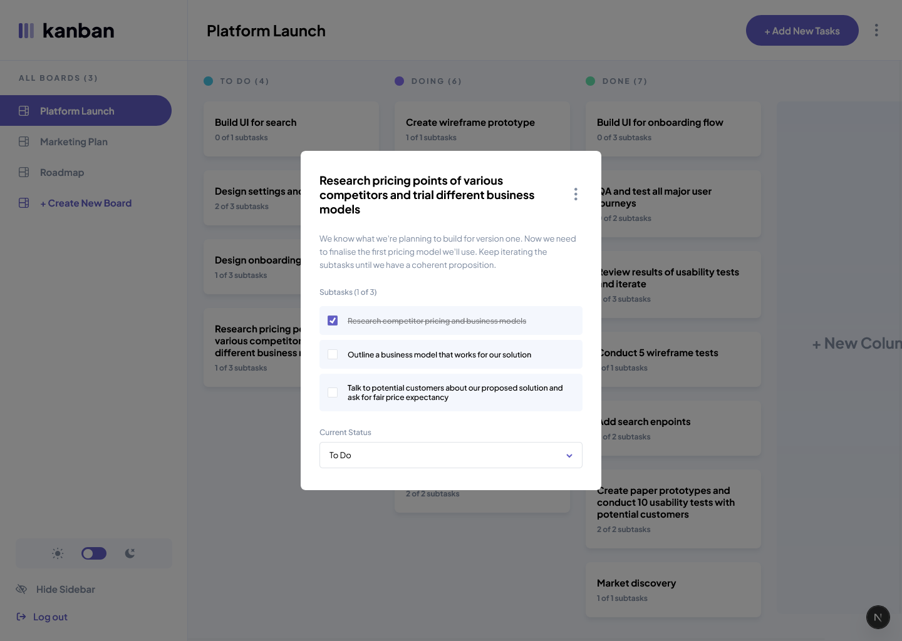

# Frontend Mentor - Kanban task management web app solution

This is a solution to the [Kanban task management web app challenge on Frontend Mentor](https://www.frontendmentor.io/challenges/kanban-task-management-web-app-wgQLt-HlbB).

## Table of contents

- [Overview](#overview)
  - [The challenge](#the-challenge)
  - [Screenshot](#screenshot)
  - [Links](#links)
- [Getting started](#getting-started)
- [My process](#my-process)
  - [Development roadmap](#development-roadmap)
  - [Key challenges](#key-challenges)
  - [Built with](#built-with)
  - [What I learned](#what-i-learned)
  - [Continued development](#continued-development)
  - [AI Tools Used](#ai-tools-used)
  - [Useful resources](#useful-resources)
- [Author](#author)

## Overview

### The challenge

Users should be able to:

- View the optimal layout for the app depending on their device's screen size
- See hover states for all interactive elements on the page
- Create, read, update, and delete boards, columns and tasks
- Receive form validations when trying to create/edit boards and tasks
- Mark subtasks as complete and move tasks between columns
- Hide/show the board sidebar
- Toggle the theme between light/dark modes
- Allow users to drag and drop tasks to change their status and re-order them in a column
- Keep track of any changes, even after refreshing the browser

### Screenshot




### Links

- Solution URL: [Solution URL](https://www.frontendmentor.io/solutions/kanban-task-app-with-nextjs-and-dnd-kit-bqk0lBwxtJ)
- Live Site URL: [Live site URL](https://kanban-taskmanagement-jia.netlify.app/)

## Getting started

To run this project locally, follow these steps:

1. **Clone the repository**
2. **Install dependencies:**

   ```bash
   npm install
   ```

3. **Set up Environment Variables:** Create a `.env.local` file and add your Firebase configuration keys.

4. **Run the development server:**

```bash
npm run dev
```

5. Open http://localhost:3000 in your browser.

## My process

### Development roadmap

To build a scalable and performant Kanban application, I followed a structured development process, moving from static UI to a fully integrated, real-time backend.

- **UI & Design System:** Leveraged the initial design specs to build a fully responsive UI using CSS Modules. I initially used local JSON data to ensure the layout was robust across all device sizes.

- **Database Integration:** Integrated **Firebase Firestore** to transition from static data to a persistent cloud database. I created a seeding script to migrate my JSON data to Firestore for consistent testing.

- **State Management:** Implemented a global state architecture using the **React Context API**. This centralizes board data, task status, and subtask progress, ensuring synchronized updates across the sidebar, the header and main board.

- **Drag & Drop Architecture:** Integrated **@dnd-kit** for a native-feeling drag-and-drop experience. I optimized this with custom sensors and collision detection strategies (like pointerWithin) to handle empty columns and complex reordering.

- **Authentication & Security:** Implemented **Firebase Auth**, supporting both traditional email/password credentials and **Google OAuth**.

- **Resilience & UX:** Integrated centralized error handling and loading states (using skeletons and spinners) to provide a smooth, professional feel during asynchronous database operations.

### Key challenges

#### Eliminating "Ghost Tasks" during Cross-Column Drags

**The Issue:** A critical bug occurred when moving the last remaining task out of a column. Because the drag-and-drop event triggers multiple rapid state updates, the task would occasionally appear in both the source and destination columns simultaneously—creating a "ghost task." This was caused by an asynchronous lag between updating the individual task's `columnId` and refreshing the arrays of IDs for each column.

**The Solution:** I implemented a robust `REORDER_MULTIPLE_TASKS` reducer logic that treats cross-column moves as an **atomic operation**.

- First, I used a `Set` to identify all affected columns (both source and target).

- Then, I updated the task's properties and **re-synchronized** the column ID arrays by filtering and sorting the entire state by `order`.

- This ensured that when a column became empty, its ID array was immediately cleared, preventing the "ghost" rendering.

```javascript
if (action.type === "REORDER_MULTIPLE_TASKS") {
  const updatedTasks = action.payload; // Array of {id, columnId, order}
  const tasksById = { ...state.tasksById };
  const columnTaskIds = { ...state.columnTaskIds };

  // 1. Identify which columns need a full refresh
  const affectedColumnIds = new Set();

  updatedTasks.forEach((update) => {
    const oldColumnId = tasksById[update.id]?.columnId;
    if (oldColumnId) affectedColumnIds.add(oldColumnId); // Add source column

    // Update the task record itself
    tasksById[update.id] = { ...tasksById[update.id], ...update };

    affectedColumnIds.add(update.columnId); // Add target column
  });

  // 2. Re-build the ID arrays for only the affected columns
  affectedColumnIds.forEach((colId) => {
    columnTaskIds[colId] = Object.values(tasksById)
      .filter((t) => t.columnId === colId)
      .sort((a, b) => a.order - b.order)
      .map((t) => t.id);
  });

  return { ...state, tasksById, columnTaskIds };
}
```

#### Optimizing Real-time Database Sync

**The Issue:** Frequent drag events (especially `onDragOver`) triggered too many database writes, leading to performance bottlenecks and potential Firebase quota issues.

**The Solution:** I separated the logic into local and sync actions.

- `reorderTasksLocal` provides immediate visual feedback using optimistic UI updates via the Context API.

- `handleDragEnd` serves as the final "source of truth," where I collect a snapshot of the final task orders and use `Promise.all` to batch the Firestore updates efficiently once the user releases the task.

#### Ensuring Droppable Consistency for Empty Columns

**The Issue:** I encountered a bug where tasks could not be dropped into empty columns upon initial page load. Since the database only returned tasks for populated columns, the state was missing keys for empty ones. `@dnd-kit` requires a registered droppable container to accept items; because these containers weren't represented in the `columnTaskIds` state, the library effectively ignored them.

**The Solution:** I refactored the data normalization layer to be "column-aware."

I updated the `normalizeTasks` utility to accept the full list of columns as an argument.

I implemented an initialization step that pre-populates `columnTaskIds` with an empty array for every valid column ID before processing the tasks.

This ensures that the `SortableContext` always has a valid reference to render, making every column on the board an active drop zone from the moment the app loads.

#### Optimizing State Architecture for Performance

**The Issue:** Initially, I used a flat array for tasks. However, as the number of tasks grew, calculating reorders and moving tasks between columns became computationally expensive. Every drag event required filtering through the entire task array to find specific items, leading to noticeable UI "jank" and slow response times during drag-and-drop interactions.

**The Solution:** I refactored the global state to a normalized data structure. By splitting tasks into `tasksById` (a lookup table) and `columnTaskIds` (an object mapping column IDs to arrays of task IDs), I achieved:

**O(1) Access:** Finding a specific task by its ID no longer requires iterating through a list.

**Instant Reordering:** Dragging within a column now only requires a simple `arrayMove` on a small list of strings (IDs), rather than re-calculating the entire task set.

**Stable References:** This structure allowed me to use `useMemo` more effectively, ensuring only the affected columns re-rendered during a move.

### Built with

- [Next.js](https://nextjs.org/) - For server-side rendering, routing, and optimized performance.

- [Firestore](https://firebase.google.com/docs/firestore) - NoSQL real-time database for persistent task management.

- [Firebase Auth](https://firebase.google.com/docs/auth) - Secure user authentication and session management.

- [dnd-kit](https://dndkit.com/) - A modular, accessible drag-and-drop library for React.

- [CSS Modules](https://github.com/css-modules/css-modules) - For scoped, maintainable component styling.

### What I learned

#### Advanced State Management

The core of this project was mastering complex state orchestration. I implemented a robust system using the **React Context API** combined with `useReducer`.

To maintain clean code, I separated the architecture into three distinct layers:

- `BoardProvider.js`: Manages the data lifecycle and provides context to the dashboard.
- `boardReducer.js`: Centralizes state transition logic for predictable updates.
- `boardActions.js`: A decoupled layer for asynchronous logic (Firestore) and optimistic UI updates.

#### Data Normalization

I refactored the state from flat arrays to a **normalized structure** to find tasks and reorder them more effectively:

```javascript
// Normalized structure for O(1) task lookups
const initialState = {
  tasksById: {
    "task-123": { id: "task-123", title: "Refactor Context", ... }
  },
  columnTaskIds: {
    "todo-col": ["task-123", "task-456"],
    "done-col": []
  }
};
```

```javascript
// normalizeTasks function
export function normalizeTasks(tasks, columns = []) {
  const tasksById = {};
  const columnTaskIds = {};

  columns.forEach((col) => {
    columnTaskIds[col.id] = [];
  });

  for (const task of tasks) {
    tasksById[task.id] = task;

    if (!columnTaskIds[task.columnId]) {
      columnTaskIds[task.columnId] = [];
    }

    columnTaskIds[task.columnId].push(task.id);
  }

  for (const columnId in columnTaskIds) {
    columnTaskIds[columnId].sort((a, b) => {
      return tasksById[a].order - tasksById[b].order;
    });
  }
}
```

This will:

- **Efficiency:** Finding a task by ID became an **O(1)** operation instead of O(n).

- **Smooth Drag-and-Drop:** By storing only IDs in the column arrays, `@dnd-kit` can reorder items with minimal re-renders, resulting in a buttery-smooth 60fps experience.

- **Consistency:** It prevented data duplication bugs and made it easier to sync local state with the Firestore backend.

#### Secure & Contextual Routing

I learned how to wrap layouts with **Authentication Providers** to protect sensitive dashboard data. I used the `useEffect` hook in conjunction with Next.js `router` to create secure client-side redirects, ensuring that only authenticated users can access the Board Context.

```javascript
export default function RootLayout({ children }) {
  return (
    <html lang="en" className={plusJakartaSans.className}>
      <body className="light">
        <div id="modal-root"></div>
        <AuthProvider>{children}</AuthProvider>
      </body>
    </html>
  );
}
```

```javascript
const handleSubmit = async (e) => {
  e.preventDefault();
  setError("");

  const isValid = validateForm();
  if (!isValid) return;

  try {
    if (isLogin) {
      await login(email, password);
    } else {
      await signup(email, password);
    }

    router.push("/boards");
  } catch (err) {
    ...
  }
};
```

### Continued development

- **State Management Exploration:** While I am comfortable with the React Context API and Redux, I want to explore more specialized state management libraries like **Zustand** or **Recoil**. My goal is to understand which tools perform best for highly interactive, real-time applications versus standard data-heavy dashboards.

- **Server-State Libraries:** In this project, I managed loading and error states manually within my Context. In future iterations, I plan to integrate **TanStack Query (React Query)** to handle data fetching, caching, and background synchronization more efficiently.

### AI Tools Used

- **Gemini (Google):** Acted as a senior pair-programming collaborator throughout the development process.
  - **Architecture & Integration:** Assisted in the initial integration of **Firebase Firestore** and the configuration of **@dnd-kit** sensors.

  - **Collaborative Debugging:** Played a key role during the testing phase. I identified edge cases—such as "ghost tasks" during cross-column moves and "non-droppable" empty columns—and collaborated with the AI to refactor the `Board.js` logic and state reducers to resolve them.

  - **Logic Optimization:** Helped refine the `handleDragOver` algorithm to ensure high-performance UI updates and stable state transitions during complex drag events.

### Useful resources

- [dnd kit](https://dndkit.com/overview)
- [Theme Switching: Dark, Light, Auto Mode in React](https://sreyas.com/blog/theme-switching-dark-light-auto-mode-in-react/?srsltid=AfmBOooWveaivZ3Yunss9Zp9vMcb43A7IW0tn6jvi7uTspNOlYAAqo6h)
- [Firebase Documentation](https://firebase.google.com/docs/firestore) - The primary reference for structuring Firestore queries and managing real-time data synchronization.

## Author

- Frontend Mentor - [@JiaHe35354](https://www.frontendmentor.io/profile/JiaHe35354)
